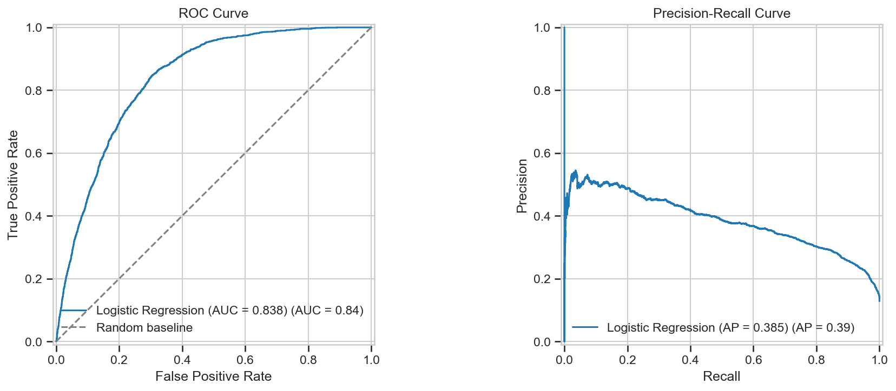
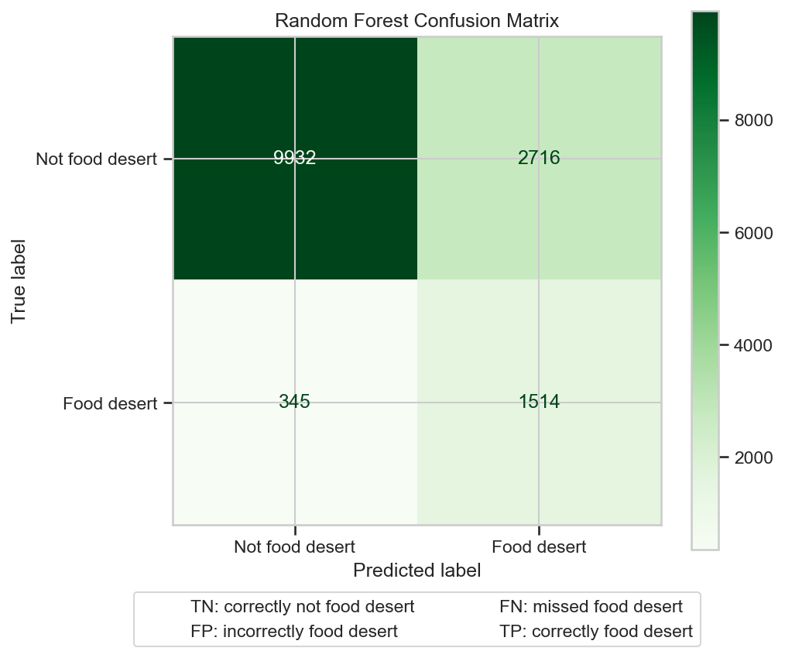
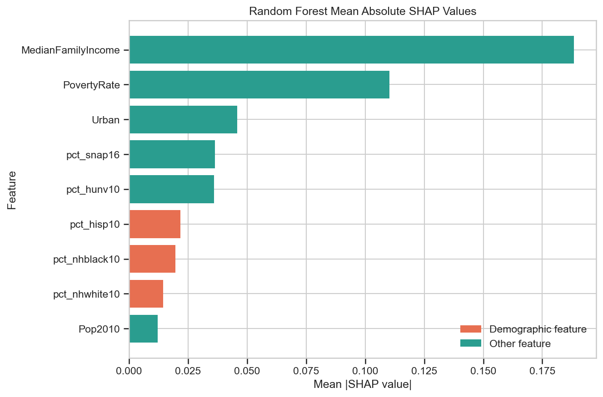
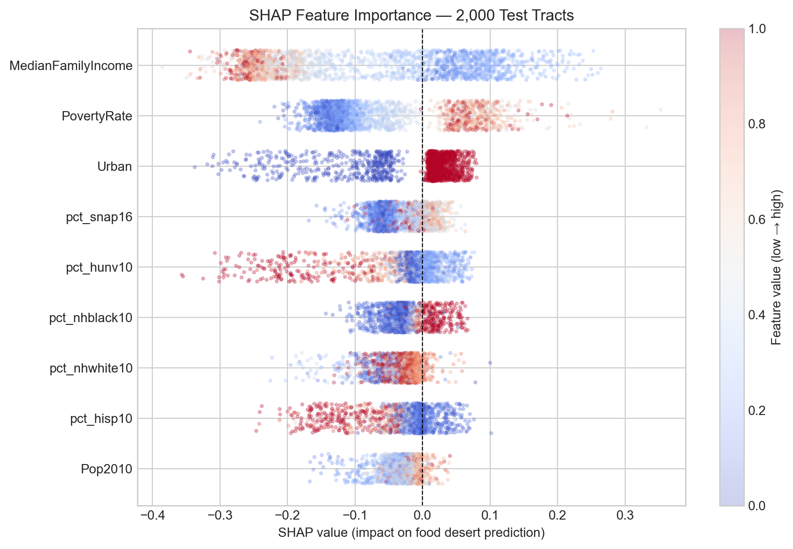
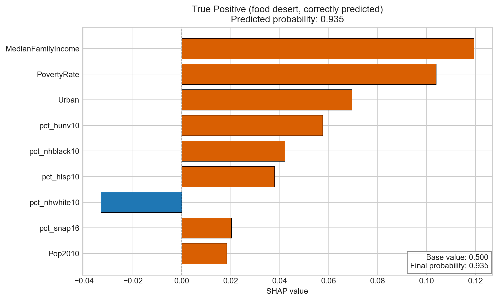
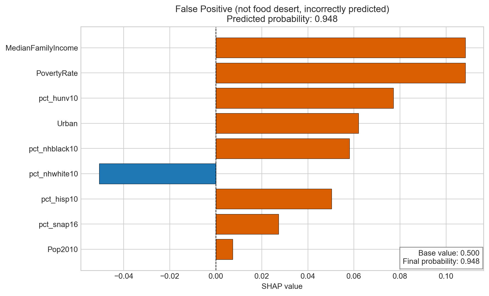
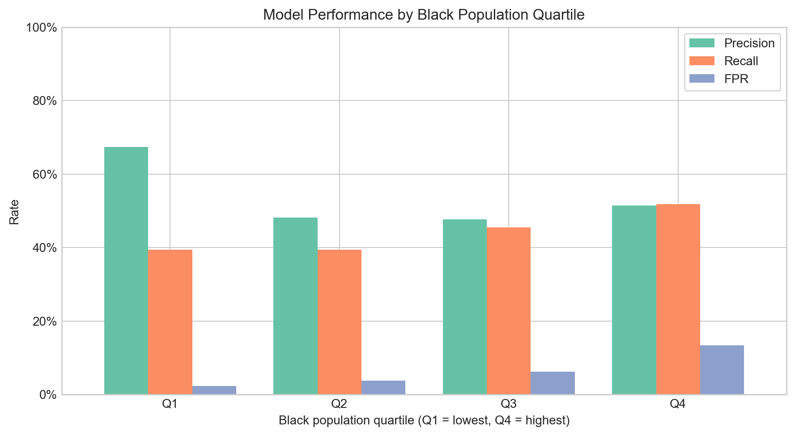
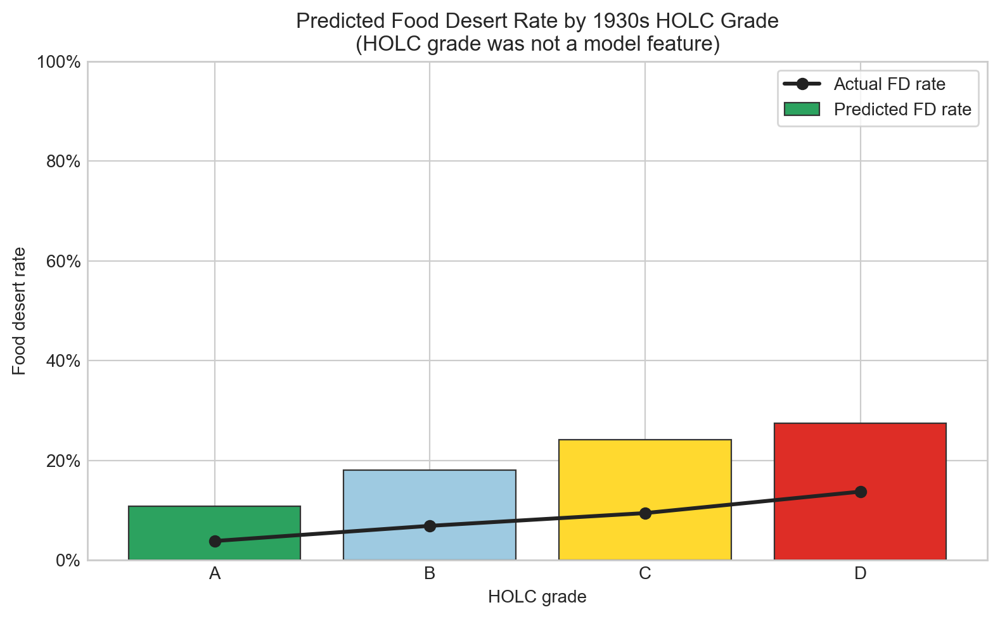
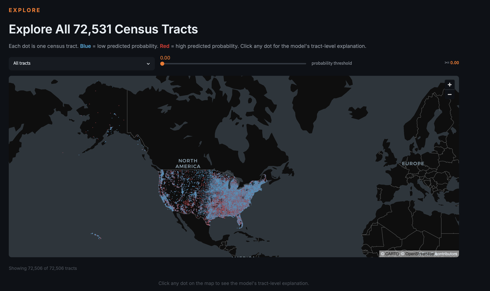

# DesertMap

**Predicting food desert status across 72,531 U.S. census tracts and auditing the model for redlining-era racial bias**

AI4ALL Ignite Accelerator — Portfolio Project

---

## The Finding

We trained a Random Forest classifier to predict which census tracts qualify as USDA-defined food deserts using nine modern socioeconomic and demographic features. No historical redlining data was included.

When we overlaid the model's predictions on 1930s HOLC redlining maps, a stark pattern emerged. Tracts historically graded C or D ("Declining" / "Hazardous") are **1.57 times more likely** to be predicted food deserts than A or B graded tracts — 25.4% vs. 16.2%. The model learned the geography of 1930s discrimination from present-day data, without ever being shown it.

Four independent bias audits confirm this pattern is not an artifact. Responsible deployment requires detecting it first.

---

## Dataset

**Source:** USDA Food Access Research Atlas 2019 — national scope, census tract level

| Split | Tracts | Class balance |
|---|---|---|
| Training (80%) | 58,024 | ~12.8% food desert |
| Test (20%) | 14,507 | ~12.8% food desert |

**Target variable:** `LILATracts_1And10` — low income AND low access at 1-mile urban / 10-mile rural threshold

**Features (9):** Median family income, poverty rate, % Black population, % Hispanic population, % White population, % households with no vehicle, % SNAP-enrolled households, total population (2010), urban/rural flag

No HOLC redlining data, ZIP codes, or neighborhood names were used in training.

---

## Model Results

| Model | F1 | Precision | Recall | ROC-AUC |
|---|---|---|---|---|
| Logistic Regression (baseline) | 0.438 | 0.302 | 0.800 | 0.838 |
| **Random Forest** | **0.525** | **0.416** | **0.710** | **0.886** |

F1 is the primary metric given the 5:1 class imbalance. The Random Forest improves F1 by 8.7 points over baseline while maintaining a 0.886 ROC-AUC.





---

## Explainability

SHAP (SHapley Additive exPlanations) was applied via TreeExplainer on a 2,000-tract representative subsample of the test set.

**Global feature importance:** Median family income and poverty rate are the dominant drivers. Racial composition features appear in the top five, carrying independent predictive signal beyond what socioeconomic variables explain.





**Tract-level explanations:** The waterfall plots below show individual predictions — a true positive (correctly flagged food desert) and a false positive (incorrectly flagged).





---

## Bias Audit

Four independent methods were used. All four converge on the same conclusion.

### 1. Race-Removed Model Delta

Retraining the model with % Black and % Hispanic removed reduces F1 by **2.2 points** (0.489 to 0.467). Racial features carry predictive signal independent of income and poverty rate.

### 2. Quartile False Positive Rate Analysis

Census tracts were grouped into quartiles by Black population share. The false positive rate in the highest quartile is **5.9 times** that of the lowest quartile.



### 3. Counterfactual Racial Composition Probe

For each tract predicted as a food desert, racial composition features were reset to the national median while holding all other features constant. **33.6% of predictions flipped** to "not a food desert." Race drives more than a third of positive predictions independently of every other variable.

### 4. HOLC Post-Prediction Overlay

The HOLC crosswalk (Mapping Inequality v3, Nelson et al. 2023) maps 1930s neighborhood grades to 2010 census tract boundaries. This data was never used in training. Tracts overlapping C- or D-graded areas have a **1.57x higher predicted food desert rate** than those overlapping A- or B-graded areas.



---

## Interactive App

The Streamlit app loads pre-computed predictions for all 72,531 tracts and allows tract-level exploration with SHAP explanations.



**Live demo:** [desertmap.streamlit.app](https://desertmap.streamlit.app)

```bash
pip install -r requirements.txt
streamlit run app/streamlit_app.py
```

---

## Reproducing the Full Pipeline

Run notebooks in order:

```bash
pip install -r requirements.txt
jupyter lab

# 01_eda.ipynb          — exploratory analysis and class distribution
# 02_cleaning.ipynb     — feature engineering and data quality
# 03_baseline_model.ipynb — logistic regression baseline
# 04_random_forest.ipynb  — random forest + SHAP
# 05_fairness_audit.ipynb — fairness audit: HOLC overlay, quartile FPR
# 06_xai.ipynb          — deep XAI: beeswarm, dependence, waterfalls, heatmap
```

All output figures write to `outputs/figures/`. Predictions and SHAP values write to `outputs/tract_predictions_shap.parquet`.

---

## Repository Structure

```
desertmap/
├── data/
│   ├── raw/                    # USDA Atlas, HOLC crosswalk, census centroids
│   └── processed/              # Cleaned and merged data
├── notebooks/
│   ├── 01_eda.ipynb
│   ├── 02_cleaning.ipynb
│   ├── 03_baseline_model.ipynb
│   ├── 04_random_forest.ipynb
│   ├── 05_fairness_audit.ipynb
│   └── 06_xai.ipynb
├── app/
│   └── streamlit_app.py
├── docs/
│   ├── proposal.md
│   ├── smart_goals.md
│   ├── bias_identification.md
│   └── fairness_audit.md
├── outputs/
│   ├── figures/
│   ├── tract_predictions_shap.parquet
│   ├── baseline_metrics.json
│   ├── rf_metrics.json
│   └── fairness_metrics.json
├── requirements.txt
└── README.md
```

---

## Data Sources

| Dataset | Source |
|---|---|
| USDA Food Access Research Atlas 2019 | ers.usda.gov |
| HOLC Neighborhood Grades Crosswalk | Mapping Inequality v3, Nelson et al. (2023) |
| Census Tract Population Centroids | U.S. Census Bureau, 2010 |
